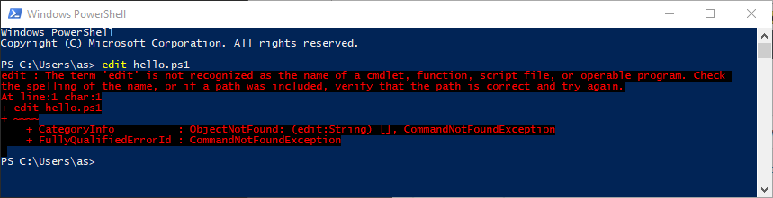

# Windows NT Console Utils

Various utilities ported Windows NT Console. 
Some editors, Dialog, Figlet, etc.

Most of the software is not mine. 
Copyrights included if available.

Because seriously WTF Microsoft?

Seriously?

# You may also be interested in...

## Editors for Windows Consoe

Check my [blog post](https://virtuallyfun.com/wordpress/2018/02/15/wanted-console-text-editor-for-windows/) for a comphrehensive list of editors for the windows console

History of [Microsoft Editor](https://virtuallyfun.com/wordpress/2018/03/11/microsoft-editor/) that you can find in [mep/](mep/) and [z/](z/) folders

## Other Windows Utilities for Windows Console

[cmdsave](https://github.com/tenox7/cmdsave) dumps contents of Windows Console / cmd.exe / Powershell window in to a text file

[cmdmax](https://github.com/tenox7/cmdmax) maximize and or set arbitrary position and size of WIndows Console window

[winsay](https://github.com/tenox7/winsay) It's a Mac OS X *say(1)* command reimplementation for Windows

[lsblk](https://github.com/tenox7/lsblk) Linux *lsblk(1)* implementation for Windows, doesn't use VDS

[listdisk](https://github.com/tenox7/listdisk) More detailed list disk utility that does not use VDS

[diskimg](https://github.com/tenox7/diskimg) Hard disk imaging (dump/restore) utility for Windows Console

[disktrim](https://github.com/tenox7/diskimg) SSD TRIM/UNMAP/DISCARD. Linux *blkdiscard(1)* for Windows

[snoopy](https://github.com/tenox7/snoopy) is a portable single exe no-driver tcp/ip packet sniffer for Windows Console

[ttg](https://github.com/tenox7/ttg) Monitor SNMP bandwidth usage from Windows Console

[regln](https://github.com/tenox7/regln) Manage Windows Registry Links (REG_LINK type)

## Even more stuff...

[yori](http://www.malsmith.net/yori/) What Windows Console Should Really Be Like
