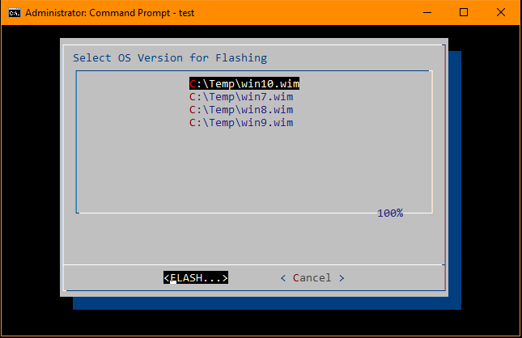

# Dialog

This is a port of Thomas E. Dickey [Dialog](https://invisible-island.net/dialog/) to Windows NT Console.

It works suprisingly well with Windows cmd.exe cmd/bat scripts. 

This example lets you select WIM file for [DISM](https://docs.microsoft.com/en-us/windows-hardware/manufacture/desktop/dism---deployment-image-servicing-and-management-technical-reference-for-windows) in [Windows PE](https://docs.microsoft.com/en-us/windows-hardware/manufacture/desktop/winpe-intro) using Dialog Menu generated from dir:

```
setlocal enabledelayedexpansion
for /f %%t in ('dir /b/s win*.wim') do set menu=!menu! %%t ""
dialog --ok-label "FLASH..." --menu "Select OS Version for Flashing" 30 60 20 !menu:~1! 2>%TEMP%\ossel.txt
endlocal
for /f %%f in (%TEMP%\ossel.txt) do set wim=%%~ff
dism /apply-image /imagefile:%wim% /index:1 /applydir:c:\
```


