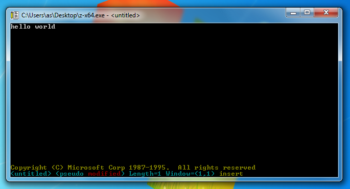

# Z Text Editor

Originally known as [Yale Z Editor](http://texteditors.org/cgi-bin/wiki.pl?Z).
Developed by Steve Woods for TOPS20 OS.

Later sold to Microsoft and ported to DOS, OS/2 and Windows by Mark Zbikowski.

Used extensively as *Microsoft C* and *Microsoft OS/2 SDK* editor.

This version is a native port to Windows NT Console. Enchanced version of MEP.

For more info visit this [blog post](https://virtuallyfun.com/wordpress/2018/03/11/microsoft-editor/)

For documentation check [the manual](doc/z.txt)

